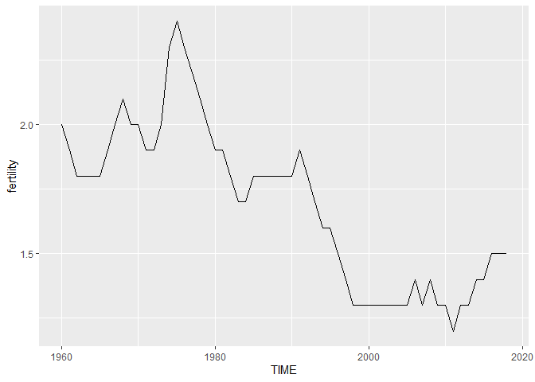
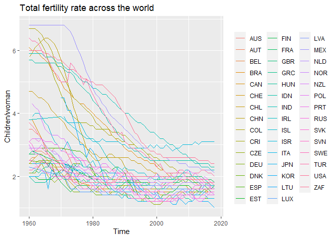
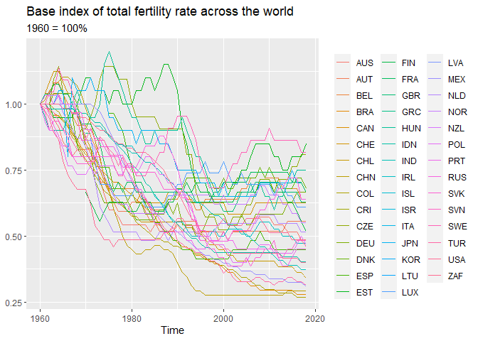
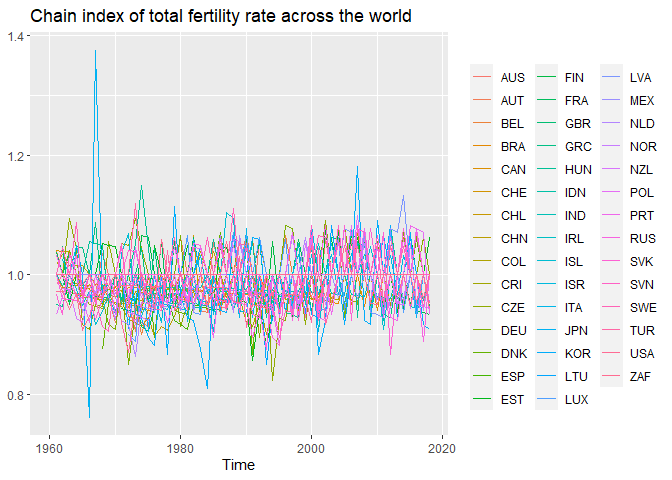
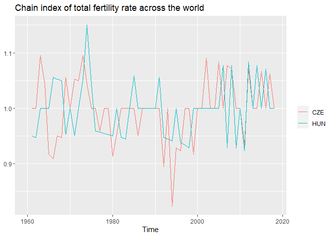
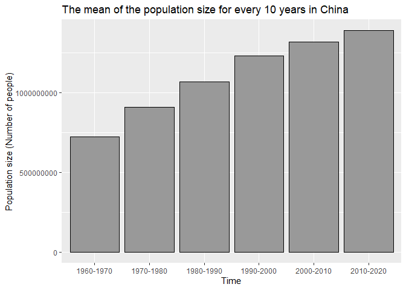

DA - Tidyverse
================
Marcell Granát
2020 10 15

Tidyverse is a collection of packages, but you have to managa it as any
other package: `install.packages(tidyverse)` if you have never used
before, and `library(tidyverse)` always, before you start to use it.
After you load in, you max see the attached packages.

``` r
library(tidyverse)
```

    ## Warning: package 'tidyverse' was built under R version 3.6.3

    ## -- Attaching packages --------

    ## <U+221A> ggplot2 3.3.0     <U+221A> purrr   0.3.3
    ## <U+221A> tibble  3.0.1     <U+221A> dplyr   1.0.0
    ## <U+221A> tidyr   1.1.0     <U+221A> stringr 1.4.0
    ## <U+221A> readr   1.3.1     <U+221A> forcats 0.5.0

    ## Warning: package 'ggplot2' was built under R version 3.6.3

    ## Warning: package 'tibble' was built under R version 3.6.3

    ## Warning: package 'tidyr' was built under R version 3.6.3

    ## Warning: package 'dplyr' was built under R version 3.6.3

    ## Warning: package 'forcats' was built under R version 3.6.3

    ## -- Conflicts -----------------
    ## x dplyr::filter() masks stats::filter()
    ## x dplyr::lag()    masks stats::lag()

Lets create the dataset we used 2 weeks ago.

``` r
fertility <- read_csv("https://stats.oecd.org/sdmx-json/data/DP_LIVE/.FERTILITY.../OECD?contentType=csv&detail=code&separator=comma&csv-lang=en")
fertility<-fertility[,c(1,6,7)]
populationsize <- read_csv("https://stats.oecd.org/sdmx-json/data/DP_LIVE/.POP.TOT.MLN_PER.A/OECD?contentType=csv&detail=code&separator=comma&csv-lang=en&startPeriod=1960&endPeriod=2018")
lifeexp <- read.csv("https://stats.oecd.org/sdmx-json/data/DP_LIVE/.LIFEEXP.TOT.YR.A/OECD?contentType=csv&detail=code&separator=comma&csv-lang=en&startPeriod=1960&endPeriod=2019")
populationsize <-populationsize[,c(1,6,7)]
lifeexp <- lifeexp[,c(1,6,7)]
names(fertility)[3] <- "fertility"
names(populationsize)[3] <- "pop"
names(lifeexp)[3] <- "lifeexp"
names(lifeexp)[1] <- "LOCATION"

df <- fertility
df <- merge(df, populationsize)
df <- merge(df,lifeexp)
```

## Pipe

Magnitr provides us to use `%>%` pipe. When you read a code, you can say
**then**, like *take the x vector, and then calculate the mean of that*.
(Later examples will make it less messy)

``` r
x <- c(1,2,3,10)
mean(x)
```

    ## [1] 4

``` r
x %>% mean()
```

    ## [1] 4

## Filter

You can filter the rows with the `filter` function.

1)  Return the rows of df, where the LOCATION is Hungary.

<!-- end list -->

``` r
filter(df, LOCATION == "HUN")
```

    ##    LOCATION TIME fertility       pop lifeexp
    ## 1       HUN 1960       2.0  9.983514    68.1
    ## 2       HUN 1961       1.9 10.027958    69.0
    ## 3       HUN 1962       1.8 10.060823    67.9
    ## 4       HUN 1963       1.8 10.087948    69.0
    ## 5       HUN 1964       1.8 10.119834    69.5
    ## 6       HUN 1965       1.8 10.147932    69.1
    ## 7       HUN 1966       1.9 10.178653    69.9
    ## 8       HUN 1967       2.0 10.216607    69.5
    ## 9       HUN 1968       2.1 10.255807    69.3
    ## 10      HUN 1969       2.0 10.298722    69.4
    ## 11      HUN 1970       2.0 10.337912    69.2
    ## 12      HUN 1971       1.9 10.367535    69.1
    ## 13      HUN 1972       1.9 10.398491    69.8
    ## 14      HUN 1973       2.0 10.432053    69.6
    ## 15      HUN 1974       2.3 10.478720    69.3
    ## 16      HUN 1975       2.4 10.540523    69.4
    ## 17      HUN 1976       2.3 10.598674    69.7
    ## 18      HUN 1977       2.2 10.648028    70.0
    ## 19      HUN 1978       2.1 10.684829    69.5
    ## 20      HUN 1979       2.0 10.704148    69.7
    ## 21      HUN 1980       1.9 10.711126    69.2
    ## 22      HUN 1981       1.9 10.711853    69.3
    ## 23      HUN 1982       1.8 10.705537    69.5
    ## 24      HUN 1983       1.7 10.689467    69.1
    ## 25      HUN 1984       1.7 10.668092    69.2
    ## 26      HUN 1985       1.8 10.648715    69.2
    ## 27      HUN 1986       1.8 10.630565    69.3
    ## 28      HUN 1987       1.8 10.612743    69.8
    ## 29      HUN 1988       1.8 10.596489    70.2
    ## 30      HUN 1989       1.8 10.481717    69.6
    ## 31      HUN 1990       1.8 10.373987    69.5
    ## 32      HUN 1991       1.9 10.373398    69.6
    ## 33      HUN 1992       1.8 10.369339    69.4
    ## 34      HUN 1993       1.7 10.357518    69.4
    ## 35      HUN 1994       1.6 10.343359    69.8
    ## 36      HUN 1995       1.6 10.328967    70.1
    ## 37      HUN 1996       1.5 10.311235    70.7
    ## 38      HUN 1997       1.4 10.290475    71.1
    ## 39      HUN 1998       1.3 10.266571    71.1
    ## 40      HUN 1999       1.3 10.237527    71.2
    ## 41      HUN 2000       1.3 10.210965    71.9
    ## 42      HUN 2001       1.3 10.187578    72.5
    ## 43      HUN 2002       1.3 10.158610    72.5
    ## 44      HUN 2003       1.3 10.129554    72.6
    ## 45      HUN 2004       1.3 10.107140    73.0
    ## 46      HUN 2005       1.3 10.087064    73.0
    ## 47      HUN 2006       1.4 10.071374    73.5
    ## 48      HUN 2007       1.3 10.055778    73.6
    ## 49      HUN 2008       1.4 10.038186    74.2
    ## 50      HUN 2009       1.3 10.022647    74.4
    ## 51      HUN 2010       1.3 10.000020    74.7
    ## 52      HUN 2011       1.2  9.958824    75.0
    ## 53      HUN 2012       1.3  9.920364    75.2
    ## 54      HUN 2013       1.3  9.893083    75.7
    ## 55      HUN 2014       1.4  9.866466    75.9
    ## 56      HUN 2015       1.4  9.843025    75.7
    ## 57      HUN 2016       1.5  9.814026    76.2
    ## 58      HUN 2017       1.5  9.787969    75.9
    ## 59      HUN 2018       1.5  9.767600    76.2

2)  Return the rows of df, where the LOCATION is Hungary or USA.

<!-- end list -->

``` r
filter(df, LOCATION == "HUN" | LOCATION == "USA")
```

    ##     LOCATION TIME fertility        pop lifeexp
    ## 1        HUN 1960       2.0   9.983514    68.1
    ## 2        HUN 1961       1.9  10.027958    69.0
    ## 3        HUN 1962       1.8  10.060823    67.9
    ## 4        HUN 1963       1.8  10.087948    69.0
    ## 5        HUN 1964       1.8  10.119834    69.5
    ## 6        HUN 1965       1.8  10.147932    69.1
    ## 7        HUN 1966       1.9  10.178653    69.9
    ## 8        HUN 1967       2.0  10.216607    69.5
    ## 9        HUN 1968       2.1  10.255807    69.3
    ## 10       HUN 1969       2.0  10.298722    69.4
    ## 11       HUN 1970       2.0  10.337912    69.2
    ## 12       HUN 1971       1.9  10.367535    69.1
    ## 13       HUN 1972       1.9  10.398491    69.8
    ## 14       HUN 1973       2.0  10.432053    69.6
    ## 15       HUN 1974       2.3  10.478720    69.3
    ## 16       HUN 1975       2.4  10.540523    69.4
    ## 17       HUN 1976       2.3  10.598674    69.7
    ## 18       HUN 1977       2.2  10.648028    70.0
    ## 19       HUN 1978       2.1  10.684829    69.5
    ## 20       HUN 1979       2.0  10.704148    69.7
    ## 21       HUN 1980       1.9  10.711126    69.2
    ## 22       HUN 1981       1.9  10.711853    69.3
    ## 23       HUN 1982       1.8  10.705537    69.5
    ## 24       HUN 1983       1.7  10.689467    69.1
    ## 25       HUN 1984       1.7  10.668092    69.2
    ## 26       HUN 1985       1.8  10.648715    69.2
    ## 27       HUN 1986       1.8  10.630565    69.3
    ## 28       HUN 1987       1.8  10.612743    69.8
    ## 29       HUN 1988       1.8  10.596489    70.2
    ## 30       HUN 1989       1.8  10.481717    69.6
    ## 31       HUN 1990       1.8  10.373987    69.5
    ## 32       HUN 1991       1.9  10.373398    69.6
    ## 33       HUN 1992       1.8  10.369339    69.4
    ## 34       HUN 1993       1.7  10.357518    69.4
    ## 35       HUN 1994       1.6  10.343359    69.8
    ## 36       HUN 1995       1.6  10.328967    70.1
    ## 37       HUN 1996       1.5  10.311235    70.7
    ## 38       HUN 1997       1.4  10.290475    71.1
    ## 39       HUN 1998       1.3  10.266571    71.1
    ## 40       HUN 1999       1.3  10.237527    71.2
    ## 41       HUN 2000       1.3  10.210965    71.9
    ## 42       HUN 2001       1.3  10.187578    72.5
    ## 43       HUN 2002       1.3  10.158610    72.5
    ## 44       HUN 2003       1.3  10.129554    72.6
    ## 45       HUN 2004       1.3  10.107140    73.0
    ## 46       HUN 2005       1.3  10.087064    73.0
    ## 47       HUN 2006       1.4  10.071374    73.5
    ## 48       HUN 2007       1.3  10.055778    73.6
    ## 49       HUN 2008       1.4  10.038186    74.2
    ## 50       HUN 2009       1.3  10.022647    74.4
    ## 51       HUN 2010       1.3  10.000020    74.7
    ## 52       HUN 2011       1.2   9.958824    75.0
    ## 53       HUN 2012       1.3   9.920364    75.2
    ## 54       HUN 2013       1.3   9.893083    75.7
    ## 55       HUN 2014       1.4   9.866466    75.9
    ## 56       HUN 2015       1.4   9.843025    75.7
    ## 57       HUN 2016       1.5   9.814026    76.2
    ## 58       HUN 2017       1.5   9.787969    75.9
    ## 59       HUN 2018       1.5   9.767600    76.2
    ## 60       USA 1960       3.7 180.671158    69.9
    ## 61       USA 1961       3.6 183.691481    70.4
    ## 62       USA 1962       3.5 186.537737    70.2
    ## 63       USA 1963       3.3 189.241798    70.0
    ## 64       USA 1964       3.2 191.888791    70.3
    ## 65       USA 1965       2.9 194.302963    70.3
    ## 66       USA 1966       2.7 196.560338    70.3
    ## 67       USA 1967       2.6 198.712056    70.7
    ## 68       USA 1968       2.5 200.706052    70.4
    ## 69       USA 1969       2.5 202.676946    70.6
    ## 70       USA 1970       2.5 205.052174    70.9
    ## 71       USA 1971       2.3 207.660677    71.2
    ## 72       USA 1972       2.0 209.896021    71.3
    ## 73       USA 1973       1.9 211.908788    71.5
    ## 74       USA 1974       1.8 213.853928    72.1
    ## 75       USA 1975       1.8 215.973199    72.7
    ## 76       USA 1976       1.7 218.035164    73.0
    ## 77       USA 1977       1.8 220.239425    73.4
    ## 78       USA 1978       1.8 222.584545    73.5
    ## 79       USA 1979       1.8 225.055487    73.9
    ## 80       USA 1980       1.8 227.224681    73.7
    ## 81       USA 1981       1.8 229.465714    74.1
    ## 82       USA 1982       1.8 231.664458    74.5
    ## 83       USA 1983       1.8 233.791994    74.6
    ## 84       USA 1984       1.8 235.824902    74.7
    ## 85       USA 1985       1.8 237.923795    74.7
    ## 86       USA 1986       1.8 240.132887    74.7
    ## 87       USA 1987       1.9 242.288918    74.9
    ## 88       USA 1988       1.9 244.498982    74.9
    ## 89       USA 1989       2.0 246.819230    75.1
    ## 90       USA 1990       2.1 249.622814    75.3
    ## 91       USA 1991       2.1 252.980941    75.5
    ## 92       USA 1992       2.0 256.514224    75.7
    ## 93       USA 1993       2.0 259.918588    75.5
    ## 94       USA 1994       2.0 263.125821    75.7
    ## 95       USA 1995       2.0 266.278393    75.7
    ## 96       USA 1996       2.0 269.394284    76.1
    ## 97       USA 1997       2.0 272.646925    76.5
    ## 98       USA 1998       2.0 275.854104    76.7
    ## 99       USA 1999       2.0 279.040168    76.7
    ## 100      USA 2000       2.1 282.162411    76.7
    ## 101      USA 2001       2.0 284.968955    76.9
    ## 102      USA 2002       2.0 287.625193    77.0
    ## 103      USA 2003       2.0 290.107933    77.1
    ## 104      USA 2004       2.0 292.805298    77.6
    ## 105      USA 2005       2.1 295.516599    77.6
    ## 106      USA 2006       2.1 298.379912    77.8
    ## 107      USA 2007       2.1 301.231207    78.1
    ## 108      USA 2008       2.1 304.093966    78.1
    ## 109      USA 2009       2.0 306.771529    78.5
    ## 110      USA 2010       1.9 309.326085    78.6
    ## 111      USA 2011       1.9 311.580009    78.7
    ## 112      USA 2012       1.9 313.874218    78.8
    ## 113      USA 2013       1.9 316.057727    78.8
    ## 114      USA 2014       1.9 318.386421    78.9
    ## 115      USA 2015       1.8 320.742673    78.7
    ## 116      USA 2016       1.8 323.071342    78.7
    ## 117      USA 2017       1.8 325.147121    78.6
    ## 118      USA 2018       1.7 327.167434    78.7

2)  Return the rows of df, where the LOCATION is Hungary or USA and the
    TIME is higher than 2000.

<!-- end list -->

``` r
filter(df, LOCATION == "HUN" | LOCATION == "USA" & TIME > 2000)
```

    ##    LOCATION TIME fertility        pop lifeexp
    ## 1       HUN 1960       2.0   9.983514    68.1
    ## 2       HUN 1961       1.9  10.027958    69.0
    ## 3       HUN 1962       1.8  10.060823    67.9
    ## 4       HUN 1963       1.8  10.087948    69.0
    ## 5       HUN 1964       1.8  10.119834    69.5
    ## 6       HUN 1965       1.8  10.147932    69.1
    ## 7       HUN 1966       1.9  10.178653    69.9
    ## 8       HUN 1967       2.0  10.216607    69.5
    ## 9       HUN 1968       2.1  10.255807    69.3
    ## 10      HUN 1969       2.0  10.298722    69.4
    ## 11      HUN 1970       2.0  10.337912    69.2
    ## 12      HUN 1971       1.9  10.367535    69.1
    ## 13      HUN 1972       1.9  10.398491    69.8
    ## 14      HUN 1973       2.0  10.432053    69.6
    ## 15      HUN 1974       2.3  10.478720    69.3
    ## 16      HUN 1975       2.4  10.540523    69.4
    ## 17      HUN 1976       2.3  10.598674    69.7
    ## 18      HUN 1977       2.2  10.648028    70.0
    ## 19      HUN 1978       2.1  10.684829    69.5
    ## 20      HUN 1979       2.0  10.704148    69.7
    ## 21      HUN 1980       1.9  10.711126    69.2
    ## 22      HUN 1981       1.9  10.711853    69.3
    ## 23      HUN 1982       1.8  10.705537    69.5
    ## 24      HUN 1983       1.7  10.689467    69.1
    ## 25      HUN 1984       1.7  10.668092    69.2
    ## 26      HUN 1985       1.8  10.648715    69.2
    ## 27      HUN 1986       1.8  10.630565    69.3
    ## 28      HUN 1987       1.8  10.612743    69.8
    ## 29      HUN 1988       1.8  10.596489    70.2
    ## 30      HUN 1989       1.8  10.481717    69.6
    ## 31      HUN 1990       1.8  10.373987    69.5
    ## 32      HUN 1991       1.9  10.373398    69.6
    ## 33      HUN 1992       1.8  10.369339    69.4
    ## 34      HUN 1993       1.7  10.357518    69.4
    ## 35      HUN 1994       1.6  10.343359    69.8
    ## 36      HUN 1995       1.6  10.328967    70.1
    ## 37      HUN 1996       1.5  10.311235    70.7
    ## 38      HUN 1997       1.4  10.290475    71.1
    ## 39      HUN 1998       1.3  10.266571    71.1
    ## 40      HUN 1999       1.3  10.237527    71.2
    ## 41      HUN 2000       1.3  10.210965    71.9
    ## 42      HUN 2001       1.3  10.187578    72.5
    ## 43      HUN 2002       1.3  10.158610    72.5
    ## 44      HUN 2003       1.3  10.129554    72.6
    ## 45      HUN 2004       1.3  10.107140    73.0
    ## 46      HUN 2005       1.3  10.087064    73.0
    ## 47      HUN 2006       1.4  10.071374    73.5
    ## 48      HUN 2007       1.3  10.055778    73.6
    ## 49      HUN 2008       1.4  10.038186    74.2
    ## 50      HUN 2009       1.3  10.022647    74.4
    ## 51      HUN 2010       1.3  10.000020    74.7
    ## 52      HUN 2011       1.2   9.958824    75.0
    ## 53      HUN 2012       1.3   9.920364    75.2
    ## 54      HUN 2013       1.3   9.893083    75.7
    ## 55      HUN 2014       1.4   9.866466    75.9
    ## 56      HUN 2015       1.4   9.843025    75.7
    ## 57      HUN 2016       1.5   9.814026    76.2
    ## 58      HUN 2017       1.5   9.787969    75.9
    ## 59      HUN 2018       1.5   9.767600    76.2
    ## 60      USA 2001       2.0 284.968955    76.9
    ## 61      USA 2002       2.0 287.625193    77.0
    ## 62      USA 2003       2.0 290.107933    77.1
    ## 63      USA 2004       2.0 292.805298    77.6
    ## 64      USA 2005       2.1 295.516599    77.6
    ## 65      USA 2006       2.1 298.379912    77.8
    ## 66      USA 2007       2.1 301.231207    78.1
    ## 67      USA 2008       2.1 304.093966    78.1
    ## 68      USA 2009       2.0 306.771529    78.5
    ## 69      USA 2010       1.9 309.326085    78.6
    ## 70      USA 2011       1.9 311.580009    78.7
    ## 71      USA 2012       1.9 313.874218    78.8
    ## 72      USA 2013       1.9 316.057727    78.8
    ## 73      USA 2014       1.9 318.386421    78.9
    ## 74      USA 2015       1.8 320.742673    78.7
    ## 75      USA 2016       1.8 323.071342    78.7
    ## 76      USA 2017       1.8 325.147121    78.6
    ## 77      USA 2018       1.7 327.167434    78.7

4)  Create a line graph from the fertility rate of Hungary

<!-- end list -->

``` r
df %>%
  filter(LOCATION == "HUN") %>%
  ggplot(mapping = aes(x = TIME, y = fertility)) + # you may realize that I only use the %>% before ggplot -> I do not need to create a new variable
  geom_line()
```

<!-- -->

# Mutate with functions

1)  Lets create the plot from the previous session.

<!-- end list -->

``` r
df %>% ggplot(aes(x = TIME, y = fertility, color = LOCATION)) + 
  geom_line() + labs(
    title = "Total fertility rate across the world",
    x = "Time",
    y = "Children/woman",
    color = NULL
  )
```

<!-- --> 2) How
much is actual fertility rate compared to the value of 1960? -\> **Base
index**

We need a funtion first to transform the values:

``` r
x <- c(2,5,7,4,2,15,6,8,10)
base.index <- function(x) {
  x/x[1]
}
base.index(x)
```

    ## [1] 1.0 2.5 3.5 2.0 1.0 7.5 3.0 4.0 5.0

``` r
y <- c(10, 40, 33, 31, 66, 244,67, 32, 54)
base.index(y)
```

    ## [1]  1.0  4.0  3.3  3.1  6.6 24.4  6.7  3.2  5.4

> When you’ve written the same code 3 times, write a function - Hadley
> Wickham, Chief Scientist at RStudio

``` r
df %>% select(LOCATION, TIME, fertility) %>% # select only the columns we need
  pivot_wider(names_from = LOCATION, values_from = fertility) %>% # add a new column to each country
  mutate_at(-1, function (x) base.index(x)) %>% # calculate the base index to each column, except the 1st one
  pivot_longer(cols = -1, names_to = "LOCATION") %>% # transfrom back to 3 columns, in order to use it with ggplot
  ggplot(mapping = aes(x = TIME, y = value, color = LOCATION)) +
  geom_line() + labs(
    title = "Base index of total fertility rate across the world",
    subtitle = "1960 = 100%",
    x = "Time",
    y = NULL,
    color = NULL
  )
```

    ## Warning: Removed 650 row(s) containing missing values (geom_path).

<!-- --> 3) How
much is rate of the actual value compared to the value of the last year?
-\> Chain index

``` r
chain.index <- function(x) {
x/lag(x)
}
```

``` r
chain.index(x)
```

    ## [1]        NA 2.5000000 1.4000000 0.5714286 0.5000000 7.5000000 0.4000000
    ## [8] 1.3333333 1.2500000

Now you can copy & paste the previous chain code, we need to change only
the 4th row.

``` r
df %>%
  select(LOCATION, TIME, fertility) %>%
  pivot_wider(names_from = LOCATION, values_from = fertility) %>% 
  mutate_at(-1, function(x) chain.index(x)) %>% 
  pivot_longer(cols = -1, names_to = "LOCATION") %>% 
  ggplot(mapping = aes(x = TIME, y = value, color = LOCATION)) + 
  geom_line() + 
  labs(
    title = "Chain index of total fertility rate across the world",
    x = "Time",
    y = NULL,
    color = NULL
  )
```

    ## Warning: Removed 240 row(s) containing missing values (geom_path).

<!-- --> This
plot is messy, lets check it only for a few countries -\> add a
`filter()` to a the beginning.

``` r
df %>%
  select(LOCATION, TIME, fertility) %>%
  filter(LOCATION == "HUN" | LOCATION == "CZE") %>% 
  pivot_wider(names_from = LOCATION, values_from = fertility) %>% 
  mutate_at(-1, function(x) chain.index(x)) %>% 
  pivot_longer(cols = -1, names_to = "LOCATION") %>% 
  ggplot(mapping = aes(x = TIME, y = value, color = LOCATION)) + 
  geom_line() + 
  labs(
    title = "Chain index of total fertility rate across the world",
    x = "Time",
    y = NULL,
    color = NULL
  )
```

    ## Warning: Removed 2 row(s) containing missing values (geom_path).

<!-- --> \#\#
Summarise

Use the summarise fn combined with the group\_by fn.

``` r
df %>% group_by(LOCATION) %>% 
  summarise(mean = mean(fertility), sd  = sd(fertility), varibility = sd(fertility)/mean(fertility))
```

    ## `summarise()` ungrouping output (override with `.groups` argument)

    ## # A tibble: 44 x 4
    ##    LOCATION  mean    sd varibility
    ##    <chr>    <dbl> <dbl>      <dbl>
    ##  1 AUS       2.15 0.526      0.245
    ##  2 AUT       1.74 0.485      0.279
    ##  3 BEL       1.84 0.353      0.192
    ##  4 BRA       3.38 1.42       0.421
    ##  5 CAN       1.70 0.389      0.229
    ##  6 CHE       1.71 0.385      0.226
    ##  7 CHL       2.74 0.907      0.331
    ##  8 CHN       3.01 1.74       0.577
    ##  9 COL       3.58 1.53       0.426
    ## 10 CRI       3.22 1.23       0.383
    ## # ... with 34 more rows

## Mutate

Previously we saw that mutate\_at can modify all the variables at the
same time. The simple mutate can create a new variable or redefine an
existing one (if the name of the new variables is the same as the
original). However, this fn will not affect the variables which are not
defined here, so we will get back the original df with this modfication.

``` r
df %>% 
  mutate( # add new variable
    pop_in_person = pop*1000000
  ) %>%
  head() # print only the first few elements
```

    ##   LOCATION TIME fertility     pop lifeexp pop_in_person
    ## 1      AUS 1960       3.5 10.2750    70.9      10275000
    ## 2      AUS 1961       3.5 10.5082    71.2      10508200
    ## 3      AUS 1962       3.4 10.7005    71.0      10700500
    ## 4      AUS 1963       3.3 10.9069    71.1      10906900
    ## 5      AUS 1964       3.2 11.1216    70.7      11121600
    ## 6      AUS 1965       3.0 11.3409    71.0      11340900

In contrast, via `transmute` you can also create new variables, but the
return will be a df only with the variables, which are defined here. For
a minimal example: calculate the average population size for every 10
years in China, but instead of Million people, lets give the result in
number of people.

``` r
options(scipen=999) # avoid R printing scientific notation
# This is not part of this class, but the plot with huge numbers will be created with 9+10e if you miss this
```

``` r
df %>% transmute( # keeps only the variables, which are defined here & u can add new ones
  LOCATION = LOCATION,
  TIME = (TIME %/% 10)*10, # removing the remaining part from dividing by 10
  pop_in_person = pop*1000000 # change the dimension
) %>% filter(LOCATION == "CHN") %>% mutate( # filter for China
  TIME = paste0(as.character(TIME), "-", as.character(TIME + 10))
) %>% group_by(TIME) %>%
  summarise(mean = mean(pop_in_person)) %>%
  ggplot(aes(x = TIME, y = mean)) +
  geom_col(color = "black", fill = "grey60") + 
  labs(x = "Time", y = "Population size (Number of people)", title = "The mean of the population size for every 10 years in China")
```

    ## `summarise()` ungrouping output (override with `.groups` argument)

<!-- -->

## Arrange

You can change the order of the rows in a df by the arrange fn.

Example: When was the highest value of life expectency in Hungary.
(Print the 5 highest)

``` r
df %>% filter(LOCATION  == "HUN") %>%
  select(TIME, lifeexp) %>% 
  arrange(desc(lifeexp)) %>% # Desc order by lifeexp
  head(5) # only the first 5 rows
```

    ##   TIME lifeexp
    ## 1 2016    76.2
    ## 2 2018    76.2
    ## 3 2014    75.9
    ## 4 2017    75.9
    ## 5 2013    75.7
